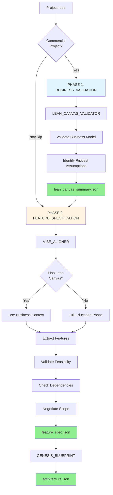

# Vibe Agency System - AI-Powered Software Planning Tool

> Transform vague project ideas into concrete, validated software specifications using Claude AI.

---

## 🤖 **FOR AI AGENTS / ASSISTANTS**

**If you're an AI agent (Claude Code, GitHub Copilot, etc.), read this FIRST:**

👉 **[AGENTS_START_HERE.md](./AGENTS_START_HERE.md)** - Critical architecture understanding for AI operators

### TL;DR for AI Agents:
- **You are the OPERATOR** of this system, not an external service
- vibe-cli is NOT autonomous - it returns **prompts** for YOU to execute
- Architecture: `You → vibe-cli → prompts back to you → you do work → save results`
- **Read [CLAUDE.md](./CLAUDE.md)** for operational status (what actually works)
- **Read [AGENTS_START_HERE.md](./AGENTS_START_HERE.md)** for detailed onboarding

**Common mistake:** Treating vibe-cli as an autonomous system that "delegates to Claude Code". **Wrong.** You use vibe-cli as a tool to get structured prompts.

---

## 🎯 What Is This?

**Vibe Agency** is a **prompt composition system** that helps consultants and agencies plan software projects systematically. It guides you from "I have an idea..." to production-ready specifications using Claude AI.

### What Makes It Special?

This is **NOT a multi-agent AI system** or automation platform. It's a **structured prompt library** with:
- 📚 **6,400+ lines of curated domain knowledge** (project templates, tech stacks, constraints)
- 🧩 **Modular prompt templates** (personality + tasks + knowledge + validation gates)
- 🎯 **Single-LLM workflow** (Claude processes each task manually)
- 📂 **File-based architecture** (no databases, no external services)

**What it does:**
- ✅ Turns vague ideas into concrete feature lists
- ✅ Validates technical feasibility (catches impossible features early)
- ✅ Recommends battle-tested tech stacks
- ✅ Estimates timeline, budget, complexity
- ✅ Detects security gaps, dependency issues
- ✅ Generates architecture blueprints ready for development

**What it's NOT:**
- ❌ Not a code generator (it plans, doesn't code)
- ❌ Not autonomous (Claude processes each step manually)*
- ❌ Not a framework you install (it's a prompt library + knowledge bases)
- ❌ Not a multi-agent system (single LLM, no agent communication)

_*Note: As of v1.2.1 (ADR-003), the system supports both **delegated execution** (default - Claude Code integration) and **autonomous mode** (legacy - for testing). See [Architecture](#-architecture) below._

---

## 🚀 Quick Start

### Setup (One Command)

```bash
make install
```

Or manually:

```bash
./setup.sh
```

### Usage

```bash
# Run a project
./vibe-cli run <project-id>

# Run tests
make test

# Check code quality
make lint

# Full validation (what CI runs)
make ci
```

### Development

```bash
# See all available commands
make help

# Run tests with coverage
make test-cov

# Auto-format code
make format

# Type check
make type-check

# Security scan
make security
```

### Requirements

- Python 3.11+
- `uv` (installed automatically by setup.sh)

### For Devcontainer Users

Open in VS Code with Dev Containers extension. Everything auto-installs.

---

## 🏗️ Architecture

**New in v1.2.1:** Delegated Execution Architecture ([ADR-003](docs/architecture/ADR-003_Delegated_Execution_Architecture.md))

Vibe Agency uses a **Brain-Arm architecture**:

```
┌──────────────────────────────────────────┐
│  CLAUDE CODE (The Brain)                 │
│  • All LLM calls & intelligence          │
│  • Full visibility into workflow         │
└──────────────────────────────────────────┘
           │ calls        ▲ returns prompt
           ▼              │
┌──────────────────────────────────────────┐
│  core_orchestrator.py (The Arm)          │
│  • State management                      │
│  • Prompt composition                    │
│  • Artifact management                   │
│  • NO direct LLM calls                   │
└──────────────────────────────────────────┘
```

**Two execution modes:**

1. **Delegated (default)** - Claude Code integration via `vibe-cli`
   - Orchestrator composes prompts, hands them to Claude Code
   - Claude Code executes and returns results
   - Full transparency and human oversight

2. **Autonomous (legacy)** - Direct API calls for testing
   - Orchestrator calls Anthropic API directly
   - No human in the loop
   - Kept for backward compatibility

**New in v1.3:** TODO-Based Handoffs
- Agents pass context to next agent via simple `handoff.json` files
- Contains completed tasks + TODO list for next agent
- Benefits: Workflow transparency, resumable execution, human-readable audit trail
- Zero complexity: Just JSON file read/write (no abstractions)

**Learn more:**
- 📖 [ADR-003: Delegated Execution Architecture](docs/architecture/ADR-003_Delegated_Execution_Architecture.md)
- 📘 [Delegated Execution Guide](docs/guides/DELEGATED_EXECUTION_GUIDE.md)
- 📋 [CHANGELOG.md](CHANGELOG.md) - See "Regression Fix" section

---

## ⚙️ Environment Setup

Vibe Agency uses a **4-layer dependency management strategy** to prevent environment regressions:

### Layer 1: Devcontainer (Recommended - Persistent)

**For GitHub Codespaces / VS Code:**

The `.devcontainer/devcontainer.json` configuration automatically installs all dependencies when you open the project. Dependencies persist across sessions.

```bash
# Open in GitHub Codespaces
# OR: Open in VS Code with "Dev Containers" extension
# Dependencies install automatically via postCreateCommand
```

### Layer 2: Auto-Install (Graceful Degradation)

`vibe-cli` automatically detects and installs missing dependencies on first run:

```bash
./vibe-cli run my-project
# ⚠️  Missing dependencies: pyyaml, beautifulsoup4
# 🔧 Auto-installing...
# ✅ Dependencies installed successfully
```

### Layer 3: Manual Setup (Fallback)

If auto-install fails, use the manual setup script:

```bash
./setup.sh
# Installs requirements.txt and validates knowledge bases
```

Or install manually:

```bash
make install  # Recommended (uses UV)
# OR
./setup.sh    # Alternative setup script
```

### Layer 4: CI Validation (Continuous Enforcement)

GitHub Actions automatically validates dependencies on every push to prevent regressions.

**Why 4 layers?** This project experienced 10+ dependency regressions in ephemeral environments. The multi-layer approach ensures dependencies are **always available** regardless of environment.

---

## 🚀 Quick Start

### New to Vibe Agency? Start Here!

**Read this first:** [QUICK_START_SESSION.md](QUICK_START_SESSION.md)
→ Complete your first planning session in 15 minutes (Todo App tutorial)

### For Your First Real Project

**1. Start a Planning Session with Claude:**

```
Say to Claude: "I want to plan a software project using Vibe Agency"

The system follows a 2-phase planning workflow:

PHASE 1: BUSINESS VALIDATION (for commercial projects)
- Agent: LEAN_CANVAS_VALIDATOR
- Validates your business model using Lean Canvas methodology
- Identifies riskiest assumptions
- Output: lean_canvas_summary.json

PHASE 2: FEATURE SPECIFICATION
- Agent: VIBE_ALIGNER
- Uses business context from Phase 1 (if available)
- Guides you through 6 phases:
  1. Education - Choose scope (MVP vs v1.0)
  2. Feature Extraction - Describe your project
  3. Feasibility Validation - Check what's possible
  4. Gap Detection - Find missing dependencies
  5. Scope Negotiation - Align scope with timeline/budget
  6. Output Generation - Get feature_spec.json

For non-commercial or technical projects, Phase 1 can be skipped.
```

**2. Example Project:**

```
You: "I want a booking system for my yoga studio. Customers book classes online,
     pay with Stripe, and get email confirmations. Budget €15k, 6 weeks."

Claude (as VIBE_ALIGNER):
→ Calibrates expectations (v1.0 vs MVP)
→ Matches to booking_system template
→ Extracts 8 core features
→ Validates feasibility (all features ✓)
→ Detects gaps (needs email service)
→ Calculates complexity (118 points = 8 weeks)
→ Negotiates scope (your 6 weeks vs estimated 8 weeks)
→ Outputs: feature_spec.json

Total time: 50-75 minutes
Result: Validated specification ready for development
```

**3. Learn More:**

- **[USER_EXPERIENCE_GUIDE.md](USER_EXPERIENCE_GUIDE.md)** - What to expect in sessions
- **[SESSION_EXAMPLES.md](SESSION_EXAMPLES.md)** - Real project transcripts
- **[HOW_CLAUDE_USES_VIBE.md](HOW_CLAUDE_USES_VIBE.md)** - How the system works

---

## 📂 Repository Structure

```
vibe-agency/
├── agency_os/                      # Core system
│   ├── 01_planning_framework/      # Planning agents
│   │   ├── agents/                 # Agent prompts (_prompt_core.md)
│   │   │   ├── LEAN_CANVAS_VALIDATOR/  # Business model validation (NEW in v1.3)
│   │   │   ├── VIBE_ALIGNER/       # Feature extraction + validation
│   │   │   └── GENESIS_BLUEPRINT/  # Architecture generation
│   │   └── knowledge/              # Knowledge bases (YAML)
│   │       ├── PROJECT_TEMPLATES.yaml       # 18 project templates
│   │       ├── TECH_STACK_PATTERNS.yaml     # 8 battle-tested stacks
│   │       ├── FAE_constraints.yaml         # Feasibility rules
│   │       ├── FDG_dependencies.yaml        # Feature dependencies
│   │       └── APCE_rules.yaml              # Complexity scoring
│   ├── 02_code_gen_framework/      # Code generation guidance
│   ├── 03_qa_framework/            # QA + testing guidance
│   ├── 04_deploy_framework/        # Deployment guidance
│   └── 05_maintenance_framework/   # Maintenance + bug triage
│
├── workspaces/                     # Client project workspaces
│   └── {client_name}/              # Per-client directory
│       └── {project_name}/         # Per-project directory
│           ├── project_manifest.json   # Single source of truth
│           └── artifacts/              # Generated outputs
│               ├── planning/           # feature_spec.json, architecture.json
│               ├── code/               # Source code artifacts
│               ├── test/               # QA reports, test results
│               └── deployment/         # Deploy receipts
│
├── .knowledge_index.yaml           # Semantic index for agents
├── PHASE_2_TEST_RESULTS.md         # Real-world testing results
└── README.md                       # This file
```

---

## 🎨 How It Works

### The Planning Workflow (2-Phase Model)



**Key Changes in v1.3:**
- Added LEAN_CANVAS_VALIDATOR as pre-flight check for commercial projects
- VIBE_ALIGNER now receives business context from Lean Canvas
- Planning state split into two sub-states: BUSINESS_VALIDATION → FEATURE_SPECIFICATION
- Backward compatible: Legacy mode (skip Lean Canvas) still supported

### What Makes It Work

**1. Project Templates (18 templates)**
- Booking systems, SaaS apps, REST APIs, Mobile apps, Marketplaces, AI apps, etc.
- Each template includes: typical features, complexity estimates, tech stack recommendations, common pitfalls

**2. Tech Stack Patterns (8 proven stacks)**
- Next.js Full-Stack, Django, FastAPI, React Native, Flutter, Socket.io, Express.js, NestJS
- Each stack includes: component breakdown, hosting recommendations, setup time, costs, when to avoid

**3. Validation Gates (10 gates)**
- Realistic timeline? Budget feasible? Tech stack coherent? Dependencies available? Security baseline met?
- Prevents common mistakes (e.g., Vercel + WebSocket = incompatible)

**4. Knowledge Bases**
- 2,546 feature dependency rules (FDG)
- 1,303 complexity scoring rules (APCE)
- 717 feasibility constraints (FAE)
- Total: ~6,000 lines of curated knowledge

---

## 💡 Example Use Cases

### 1. Client Consultation
**Before Vibe Agency:**
> "Sure, we can build that... [3 months later: scope creep, budget overruns, missed deadline]"

**With Vibe Agency:**
> "Let me spec that out... [1 hour later: concrete features, validated tech stack, realistic timeline, known risks]"

### 2. Proposal Generation
Use Vibe Agency outputs to generate detailed, professional proposals:
- Feature list with complexity estimates
- Tech stack recommendation with rationale
- Budget breakdown (dev + infrastructure + buffer)
- Timeline with milestones
- Risk assessment

### 3. Learning Projects
Beginners can use the `simple_crud_learning` template:
- Basic CRUD app guide
- Free tier recommendations (Vercel + Supabase = $0)
- Week-by-week learning path
- Links to official tutorials

---

## 📊 Content Overview

### Phase 1: Templates & Tech Stacks (Completed)
- ✅ 18 project templates (from 6)
- ✅ 8 tech stack patterns (new)
- ✅ 5 business-focused gates (timeline, budget, security, tech coherence, dependencies)
- ✅ 11 detailed templates (SaaS, API, Real-time, CMS, Marketplace, AI, Analytics, LMS, Learning)

### Phase 2: Real-World Testing (Completed)
- ✅ Tested 3 scenarios (Booking System, REST API, Learning Project)
- ✅ Identified gaps (analytics, learning projects, budget clarity)
- ✅ Fixed HIGH priority gaps
- ✅ Documented MEDIUM/LOW priority improvements

### What's Different from Generic AI Chat?

| Generic ChatGPT | Vibe Agency System |
|-----------------|-------------------|
| Generic advice ("use a database") | Specific recommendations ("PostgreSQL via Supabase Pro €25/mo") |
| No validation | 10 validation gates catch mistakes |
| Random tech suggestions | 8 battle-tested, proven stacks |
| No cost estimation | Budget breakdown (dev + infra + services + 20% buffer) |
| No security checks | OWASP Top 10 baseline validation |
| Optimistic timelines | Realistic estimates with risk buffers |
| Remembers nothing | Structured artifacts (JSON) for handoff |

---

## 🛠️ Tech Stack (What Powers This)

**This repository contains:**
- Markdown prompts (for Claude AI)
- YAML knowledge bases (templates, rules, patterns)
- JSON schemas (data contracts)
- Validation gate definitions

**Not included (you provide):**
- Claude AI (via Anthropic API or Claude.ai)
- Your domain expertise
- Your client requirements

---

## 🎓 Who Is This For?

### Perfect For:
- ✅ **Consultants/Agencies** planning client projects
- ✅ **Solo developers** scoping side projects
- ✅ **Product managers** defining MVPs
- ✅ **Beginners** learning software architecture
- ✅ **CTOs** evaluating project feasibility

### Not For:
- ❌ Enterprises needing formal governance (too lightweight)
- ❌ Projects already in development (this is for planning phase)
- ❌ Non-software projects

---

## 📚 Documentation

### Getting Started
- **[QUICK_START_SESSION.md](QUICK_START_SESSION.md)** - Your first project in 15 minutes
- **[USER_EXPERIENCE_GUIDE.md](USER_EXPERIENCE_GUIDE.md)** - What to expect in sessions
- **[SESSION_EXAMPLES.md](SESSION_EXAMPLES.md)** - Real planning session transcripts

### Understanding the System
- **[HOW_CLAUDE_USES_VIBE.md](HOW_CLAUDE_USES_VIBE.md)** - How Claude uses the framework
- **[CLAUDE_SESSION_GUIDE.md](CLAUDE_SESSION_GUIDE.md)** - Technical implementation (for Claude)
- **[V1_RELEASE_READINESS.md](V1_RELEASE_READINESS.md)** - What's in v1.0

### Architecture & Development
- **[ARCHITECTURE_AUDIT_REPORT.md](ARCHITECTURE_AUDIT_REPORT.md)** - Architecture audit results
- **[FINAL_SUMMARY.md](FINAL_SUMMARY.md)** - NFR implementation summary
- **[CONTRIBUTING.md](CONTRIBUTING.md)** - How to contribute

### Knowledge Bases
- **PROJECT_TEMPLATES.yaml** - 18 project templates
- **TECH_STACK_PATTERNS.yaml** - 8 battle-tested tech stacks
- **FAE_constraints.yaml** - 717 feasibility rules
- **FDG_dependencies.yaml** - 2,546 dependency rules
- **APCE_rules.yaml** - 1,303 complexity rules

---

## 🚦 Current Status

**Version:** 1.0 (RELEASED)
- ✅ All 7 agents implemented (31 tasks total)
- ✅ Complete knowledge bases (18 templates, 8 tech stacks, 6,400+ lines)
- ✅ All tests passing (23/23 integration tests)
- ✅ Complete documentation (5 comprehensive guides)
- ✅ Production-ready NFRs (security, performance, reliability)

**Maturity:** Production-Ready
- Core system: 100% functional
- Documentation: Complete
- Testing: All passing
- Ready for production use

**Known Limitations:**
- No automated runtime (manual Claude processing)
- Templates focus on web/mobile (limited desktop, IoT, embedded)
- Rates assume EU/US market (adjust for other regions)
- English only (no i18n)

---

## 🤝 Contributing

This is a living system. Contributions welcome:
- **Templates:** Add more project types (gaming, IoT, embedded, etc.)
- **Tech Stacks:** Add frameworks (Svelte, Solid.js, Go, Rust, etc.)
- **Gates:** Add validation rules
- **Real-World Testing:** Document your usage, share findings

---

## 📝 License

[Your License Here - TBD]

---

## 🙋 Support

- **Issues:** Report at [GitHub Issues](https://github.com/kimeisele/vibe-agency/issues)
- **Discussions:** [GitHub Discussions](https://github.com/kimeisele/vibe-agency/discussions)
- **Email:** [Your Contact]

---

## ✨ What's Next?

1. **Try it on a real project** - Document results
2. **Iterate based on findings** - Add missing patterns
3. **Build a lightweight UI** (optional) - Streamlit or web interface
4. **Integrate with tools** (future) - GitHub Issues, Linear, Figma

**Ready to start?** Copy a prompt, load it into Claude, and spec your next project! 🚀
