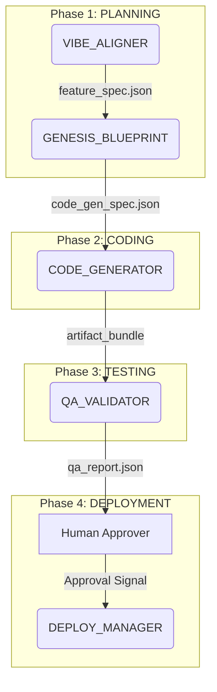

# Agency OS - A Codified System of Governance for Software Development

## Core Philosophy

Agency OS (AOS) is not a software library or a framework in the traditional sense. It is a **codified system of governance for software development**, designed to be executed by a hybrid of AI agents and human experts.

Its primary goal is to **drastically reduce the risk of v1.0 software project failure** by enforcing proven engineering discipline, eliminating scope creep, and automating best practices. It achieves this by treating the Software Development Lifecycle (SDLC) as a formal, executable state machine.

The entire system is "artifact-centric," meaning the workflow is driven by the creation and status of data artifacts (like `feature_spec.json` or `qa_report.json`), not by direct human commands.

## Project Structure

The repository is organized as follows:

-   **`agency_os/`**: Contains the core "operating system," including the prompts and knowledge bases for each specialist AI agent (e.g., Planning, Code Generation, QA).
-   **`system_steward_framework/`**: Contains the meta-level governance for the system itself, including architectural documentation, Standard Operating Procedures (SOPs), and templates.
-   **`workspaces/`**: Dedicated directory for client projects and internal work. Each workspace contains a `project_manifest.json` (single source of truth) and an `artifacts/` directory for generated outputs.
-   **`.knowledge_index.yaml`**: Machine-readable semantic index for AI agents to discover rules, constraints, and specifications by intent (e.g., "What is the test coverage requirement?").
-   **`docs/`**: High-level analysis and documentation about the Agency OS system itself.

### What This Repository Is

This is the **SPECIFICATION** of Agency OS, not its implementation:
- ✅ Prompts for specialist AI agents (written in Markdown)
- ✅ Knowledge bases with rules, constraints, and dependencies (YAML files)
- ✅ State machine definition for the SDLC workflow
- ✅ Data contracts (JSON schemas) for all artifacts

### What This Repository Is NOT

- ❌ A software library you `npm install` or `pip install`
- ❌ Executable code that runs standalone
- ❌ A framework you import into your application

To **use** this system, load these prompts and knowledge bases into an AI agent runtime (like Claude with Temporal or Prefect for durable execution).

## Getting Started & Analysis

This repository contains the definition of the Agency OS. To understand its architecture, philosophy, and potential weaknesses, please refer to the following analysis reports:

1.  **High-Level Summary:** [`AGENCY_OS_FUNDAMENTAL_UNDERSTANDING.md`](./AGENCY_OS_FUNDAMENTAL_UNDERSTANDING.md)
    - A concise, management-level overview of the system.

2.  **Detailed Technical Analysis:** [`AGENCY_OS_DEEP_DIVE_ANALYSIS.md`](./AGENCY_OS_DEEP_DIVE_ANALYSIS.md)
    - A comprehensive, evidence-based report for technical experts, including direct references to the source files that inform the analysis.

## Workflow

The end-to-end workflow is orchestrated by the `AGENCY_OS_ORCHESTRATOR` and follows a strict, state-driven process:

