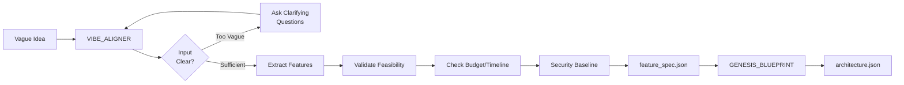

# Vibe Agency System - AI-Powered Software Planning Tool

> Transform vague project ideas into concrete, validated software specifications using Claude AI.

---

## 🎯 What Is This?

**Vibe Agency** is a **prompt composition system** that helps consultants and agencies plan software projects systematically. It guides you from "I have an idea..." to production-ready specifications using Claude AI.

**What it does:**
- ✅ Turns vague ideas into concrete feature lists
- ✅ Validates technical feasibility (catches impossible features early)
- ✅ Recommends battle-tested tech stacks
- ✅ Estimates timeline, budget, complexity
- ✅ Detects security gaps, dependency issues
- ✅ Generates architecture blueprints ready for development

**What it's NOT:**
- ❌ Not a code generator (it plans, doesn't code)
- ❌ Not automation (Claude processes each step manually)
- ❌ Not a framework you install (it's prompts + knowledge bases)

---

## 🚀 Quick Start

### 1. **Set Up a Project Workspace**
```bash
# Create workspace for a new client project
mkdir -p workspaces/my_client/yoga_booking/artifacts/{planning,code,test,deployment}

# Copy manifest template
cp project_manifest.json workspaces/my_client/yoga_booking/
```

### 2. **Load Prompts into Claude**
Use the provided prompts to compose a complete planning session:

```
Load: agency_os/01_planning_framework/agents/VIBE_ALIGNER/_prompt_core.md
Load: agency_os/01_planning_framework/knowledge/PROJECT_TEMPLATES.yaml
Load: agency_os/01_planning_framework/knowledge/TECH_STACK_PATTERNS.yaml
```

### 3. **Start Planning**
Provide your project idea to Claude (now equipped with Vibe Agency prompts):

```
USER: "I want a booking website for my yoga studio. Customers should be able to
see available classes, book a slot, and get email confirmation. Budget €25k, 6 weeks."

VIBE_ALIGNER (Claude with prompts):
- Detects project type: Booking System ✅
- Matches template: booking_system ✅
- Recommends stack: Next.js + Prisma + PostgreSQL + Stripe + Vercel ✅
- Validates budget: €25k for €29k estimate → YELLOW (tight but workable) ⚠️
- Validates timeline: 6 weeks for 9 weeks estimate → YELLOW (aggressive) ⚠️
- Security check: HTTPS, password hashing, Stripe (no card storage) ✅
- Output: feature_spec.json → save to workspaces/my_client/yoga_booking/artifacts/planning/
```

### 4. **Next Steps**
- Use GENESIS_BLUEPRINT to generate architecture
- Use CODE_GENERATOR prompts to guide development
- Use QA_VALIDATOR for testing guidelines

---

## 📂 Repository Structure

```
vibe-agency/
├── agency_os/                      # Core system
│   ├── 01_planning_framework/      # Planning agents (VIBE_ALIGNER, GENESIS_BLUEPRINT)
│   │   ├── agents/                 # Agent prompts (_prompt_core.md)
│   │   │   ├── VIBE_ALIGNER/       # Feature extraction + validation
│   │   │   └── GENESIS_BLUEPRINT/  # Architecture generation
│   │   └── knowledge/              # Knowledge bases (YAML)
│   │       ├── PROJECT_TEMPLATES.yaml       # 18 project templates
│   │       ├── TECH_STACK_PATTERNS.yaml     # 8 battle-tested stacks
│   │       ├── FAE_constraints.yaml         # Feasibility rules
│   │       ├── FDG_dependencies.yaml        # Feature dependencies
│   │       └── APCE_rules.yaml              # Complexity scoring
│   ├── 02_code_gen_framework/      # Code generation guidance
│   ├── 03_qa_framework/            # QA + testing guidance
│   ├── 04_deploy_framework/        # Deployment guidance
│   └── 05_maintenance_framework/   # Maintenance + bug triage
│
├── workspaces/                     # Client project workspaces
│   └── {client_name}/              # Per-client directory
│       └── {project_name}/         # Per-project directory
│           ├── project_manifest.json   # Single source of truth
│           └── artifacts/              # Generated outputs
│               ├── planning/           # feature_spec.json, architecture.json
│               ├── code/               # Source code artifacts
│               ├── test/               # QA reports, test results
│               └── deployment/         # Deploy receipts
│
├── .knowledge_index.yaml           # Semantic index for agents
├── PHASE_2_TEST_RESULTS.md         # Real-world testing results
└── README.md                       # This file
```

---

## 🎨 How It Works

### The Planning Workflow



### What Makes It Work

**1. Project Templates (18 templates)**
- Booking systems, SaaS apps, REST APIs, Mobile apps, Marketplaces, AI apps, etc.
- Each template includes: typical features, complexity estimates, tech stack recommendations, common pitfalls

**2. Tech Stack Patterns (8 proven stacks)**
- Next.js Full-Stack, Django, FastAPI, React Native, Flutter, Socket.io, Express.js, NestJS
- Each stack includes: component breakdown, hosting recommendations, setup time, costs, when to avoid

**3. Validation Gates (10 gates)**
- Realistic timeline? Budget feasible? Tech stack coherent? Dependencies available? Security baseline met?
- Prevents common mistakes (e.g., Vercel + WebSocket = incompatible)

**4. Knowledge Bases**
- 2,546 feature dependency rules (FDG)
- 1,303 complexity scoring rules (APCE)
- 717 feasibility constraints (FAE)
- Total: ~6,000 lines of curated knowledge

---

## 💡 Example Use Cases

### 1. Client Consultation
**Before Vibe Agency:**
> "Sure, we can build that... [3 months later: scope creep, budget overruns, missed deadline]"

**With Vibe Agency:**
> "Let me spec that out... [1 hour later: concrete features, validated tech stack, realistic timeline, known risks]"

### 2. Proposal Generation
Use Vibe Agency outputs to generate detailed, professional proposals:
- Feature list with complexity estimates
- Tech stack recommendation with rationale
- Budget breakdown (dev + infrastructure + buffer)
- Timeline with milestones
- Risk assessment

### 3. Learning Projects
Beginners can use the `simple_crud_learning` template:
- Basic CRUD app guide
- Free tier recommendations (Vercel + Supabase = $0)
- Week-by-week learning path
- Links to official tutorials

---

## 📊 Content Overview

### Phase 1: Templates & Tech Stacks (Completed)
- ✅ 18 project templates (from 6)
- ✅ 8 tech stack patterns (new)
- ✅ 5 business-focused gates (timeline, budget, security, tech coherence, dependencies)
- ✅ 11 detailed templates (SaaS, API, Real-time, CMS, Marketplace, AI, Analytics, LMS, Learning)

### Phase 2: Real-World Testing (Completed)
- ✅ Tested 3 scenarios (Booking System, REST API, Learning Project)
- ✅ Identified gaps (analytics, learning projects, budget clarity)
- ✅ Fixed HIGH priority gaps
- ✅ Documented MEDIUM/LOW priority improvements

### What's Different from Generic AI Chat?

| Generic ChatGPT | Vibe Agency System |
|-----------------|-------------------|
| Generic advice ("use a database") | Specific recommendations ("PostgreSQL via Supabase Pro €25/mo") |
| No validation | 10 validation gates catch mistakes |
| Random tech suggestions | 8 battle-tested, proven stacks |
| No cost estimation | Budget breakdown (dev + infra + services + 20% buffer) |
| No security checks | OWASP Top 10 baseline validation |
| Optimistic timelines | Realistic estimates with risk buffers |
| Remembers nothing | Structured artifacts (JSON) for handoff |

---

## 🛠️ Tech Stack (What Powers This)

**This repository contains:**
- Markdown prompts (for Claude AI)
- YAML knowledge bases (templates, rules, patterns)
- JSON schemas (data contracts)
- Validation gate definitions

**Not included (you provide):**
- Claude AI (via Anthropic API or Claude.ai)
- Your domain expertise
- Your client requirements

---

## 🎓 Who Is This For?

### Perfect For:
- ✅ **Consultants/Agencies** planning client projects
- ✅ **Solo developers** scoping side projects
- ✅ **Product managers** defining MVPs
- ✅ **Beginners** learning software architecture
- ✅ **CTOs** evaluating project feasibility

### Not For:
- ❌ Enterprises needing formal governance (too lightweight)
- ❌ Projects already in development (this is for planning phase)
- ❌ Non-software projects

---

## 📚 Documentation

- **Quick Start:** This README
- **Test Results:** `PHASE_2_TEST_RESULTS.md` (real scenarios tested)
- **External Review:** `EXTERNAL_REVIEW_REPORT.md` (gaps analysis)
- **Architecture:** `docs/guides/DEVELOPER_GUIDE.md`
- **Templates:** `agency_os/01_planning_framework/knowledge/PROJECT_TEMPLATES.yaml`
- **Tech Stacks:** `agency_os/01_planning_framework/knowledge/TECH_STACK_PATTERNS.yaml`

---

## 🚦 Current Status

**Version:** 1.0 (Content-Complete)
- ✅ Phase 1: Content Enrichment - DONE (templates, tech stacks, gates)
- ✅ Phase 2: Testing + Fixes - DONE (3 scenarios tested, HIGH priority gaps fixed)
- 🔄 Phase 3: Real-World Validation - NEXT (use on actual client project)

**Maturity:** Early but functional
- Core planning workflow verified (23/23 tests passing)
- Content significantly expanded (from 6 to 18 templates, +8 tech stacks)
- Real-world tested (3 scenarios documented)
- Ready for pilot usage

**Known Limitations:**
- No automated runtime (manual Claude processing)
- Templates focus on web/mobile (limited desktop, IoT, embedded)
- Rates assume EU/US market (adjust for other regions)
- English only (no i18n)

---

## 🤝 Contributing

This is a living system. Contributions welcome:
- **Templates:** Add more project types (gaming, IoT, embedded, etc.)
- **Tech Stacks:** Add frameworks (Svelte, Solid.js, Go, Rust, etc.)
- **Gates:** Add validation rules
- **Real-World Testing:** Document your usage, share findings

---

## 📝 License

[Your License Here - TBD]

---

## 🙋 Support

- **Issues:** Report at [GitHub Issues](https://github.com/kimeisele/vibe-agency/issues)
- **Discussions:** [GitHub Discussions](https://github.com/kimeisele/vibe-agency/discussions)
- **Email:** [Your Contact]

---

## ✨ What's Next?

1. **Try it on a real project** - Document results
2. **Iterate based on findings** - Add missing patterns
3. **Build a lightweight UI** (optional) - Streamlit or web interface
4. **Integrate with tools** (future) - GitHub Issues, Linear, Figma

**Ready to start?** Copy a prompt, load it into Claude, and spec your next project! 🚀
