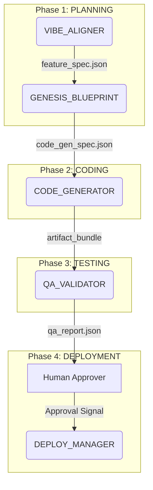

# Agency OS: Fundamental Understanding & Analysis

**Version:** 1.0
**Date:** 2025-11-12
**Author:** Gemini Code Assistant

## Part 1: Core Philosophy & Intended User Journey

**Core Philosophy:** Agency OS (AOS) is not a software library or a framework in the traditional sense. It is a **codified system of governance for software development**, designed to be executed by a hybrid of AI agents and human experts. Its primary goal is to **drastically reduce the risk of v1.0 software project failure** by enforcing proven engineering discipline, eliminating scope creep, and automating best practices. It achieves this by treating the Software Development Lifecycle (SDLC) as a formal, executable state machine.

**Intended User Journey:** The system is designed for a **non-technical or semi-technical founder/product owner**. The journey is as follows:

1.  **Vibe Alignment:** The user starts by having a natural language conversation with the `VIBE_ALIGNER` agent. The agent's job is to take a vague idea (e.g., "I want to build Airbnb for dogs") and, through a guided dialogue, transform it into a concrete, validated, and strictly-scoped feature list (`feature_spec.json`). The agent actively pushes back on features that are too complex for a v1.0, using its knowledge base (`FAE_constraints.yaml`) to justify its decisions.
2.  **Automated Execution:** Once the feature spec is approved, the user's primary role is complete. The `AGENCY_OS_ORCHESTRATOR` takes over, moving the project through the `PLANNING`, `CODING`, and `TESTING` phases automatically. Specialist agents (`GENESIS_BLUEPRINT`, `CODE_GENERATOR`, `QA_VALIDATOR`) perform the work at each stage, using the artifact from the previous stage as their input.
3.  **Human-in-the-Loop (HITL) Approval:** The system's execution automatically pauses at the `AWAITING_QA_APPROVAL` state. The user is presented with a `qa_report.json`, which summarizes the results of the automated testing. The user's only task is to make a **Go/No-Go decision**. They are not expected to review code, but to act as a final business sign-off.
4.  **Deployment & Maintenance:** If the user approves, the `DEPLOY_MANAGER` deploys the application. Post-launch, any issues are fed back into the system as `bug_report.json` files, which the `BUG_TRIAGE` agent automatically assesses and prioritizes.

---

## Part 2: Architecture & Core Abstractions

The architecture of AOS is defined by a set of core, interlocking abstractions that enforce the philosophy.

**1. The State Machine (SDLC as Code):**
The entire SDLC is defined in `ORCHESTRATION_workflow_design.yaml`. This is the highest level of abstraction. The system *is* the execution of this state machine, with the `AGENCY_OS_ORCHESTRATOR` agent acting as the executor.

**2. Artifact-Centric Workflow (Data is the Trigger):**
The system is not driven by commands, but by the **creation and status of data artifacts**. For example, the creation of a `feature_spec.json` triggers the `PLANNING` state, and a `qa_report.json` with `status: PASSED` is the prerequisite for the `AWAITING_QA_APPROVAL` state. This makes the entire process auditable and reproducible.

**3. The Specialist Agent Model (Separation of Concerns):**
The system is composed of single-purpose agents (e.g., `CODE_GENERATOR`, `QA_VALIDATOR`). Each agent corresponds to a specific framework and state in the SDLC. This makes the system modular and extensible.

**4. Human-in-the-Loop as a Service (HITL as a Blocking Task):**
The human is treated as a "service" that the state machine calls for tasks requiring subjective judgment. The `AWAITING_QA_APPROVAL` state is a formal, durable "pause" where the workflow stops and waits for an external signal from the human "service" to resume.

**5. Knowledge-Driven Agents (Prompts + YAML):**
The "intelligence" of each agent is defined by a prompt (`.md`) that sets its role and a set of knowledge files (`.yaml`) that provide the rules and constraints. This makes the system's behavior configurable and auditable.

---

## Part 3: Governance & Constraints

The governance of AOS is a multi-layered system of automated checks and balances designed to enforce engineering discipline.

1.  **Scope Governance (The "No" Engine):** The `VIBE_ALIGNER` agent uses `FAE_constraints.yaml` and `APCE_rules.yaml` to automatically reject features unsuitable for a v1.0 and to enforce a total "complexity budget." It governs the **scope** before code is written.

2.  **Generation Governance (The "Safe Code" Engine):** The `CODE_GENERATOR` is governed by `CODE_GEN_quality_rules.yaml`, which defines a `v1.0_gate_profile` with measurable thresholds for test coverage (>70%), complexity, and duplication. It governs the **quality** of the generated code.

3.  **QA Governance (The "Impartial Judge" Engine):** The `QA_VALIDATOR` uses `QA_quality_rules.yaml` to enforce a binary "Definition of Done" (`qa_approved_dod`), which includes rules like `blocker_bugs_open == 0`. It governs the **release criteria**.

4.  **Deployment Governance (The "Safety" Engine):** The `DEPLOY_MANAGER` is governed by `DEPLOY_quality_rules.yaml`, which defines automated rollback triggers based on "Golden Signals" (latency, error rate). It governs the **stability** of production.

5.  **Maintenance Governance (The "Triage" Engine):** The `BUG_TRIAGE` agent uses `MAINTENANCE_triage_rules.yaml` to enforce SLAs for bug fixes and automatically escalates issues if those SLAs are breached. It governs the **process** of handling production issues.

---

## Part 4: Gaps & Blind Spots

The analysis revealed several critical gaps, primarily stemming from an over-reliance on ideal conditions and "perfect execution" by both AI and human operators.

1.  **Manual Project Bootstrap:** There is no automated tool for creating a new project. The process relies on a human manually copying and editing `project_manifest_template.json`, creating a risk of errors from the very beginning.

2.  **Weak Architectural Enforcement:** The "stdlib-only core" rule, a key architectural principle, is defined in a prompt but not enforced by any automated quality gate in `CODE_GEN_quality_rules.yaml`. The system hopes the agent will comply but does not verify it.

3.  **Undefined Knowledge Management:** The system's intelligence resides in the YAML knowledge bases, yet there is no documented process for updating or curating this knowledge. This creates a high risk of the knowledge base becoming stale, leading to outdated and suboptimal outputs.

4.  **The HITL Bottleneck:** The system is designed to wait indefinitely for human approval at the `AWAITING_QA_APPROVAL` state. It lacks standard workflow features like timeouts, reminders, or escalations, creating a major operational risk where a project can be stalled permanently.

5.  **Myopic Production Feedback Loop:** The framework's only mechanism for learning from production is a reactive bug-fixing loop. It has no defined process for feeding strategic insights (e.g., performance hotspots, user analytics) back into the planning and architecture phases for future versions, leading to inevitable architectural decay.

---

## Part 5: Context & Next Steps

**Current State:** The `project_manifest.json` shows the project is currently in the `CODING` phase. This means the initial planning and architecture phases are complete, and the `CODE_GENERATOR` agent is notionally "at work."

**Next Logical Steps for the Project:**

1.  **Complete the `CODING` phase:** The `CODE_GENERATOR` agent needs to produce the `artifact_bundle` and `test_plan.json`.
2.  **Proceed to `TESTING`:** The `AGENCY_OS_ORCHESTRATOR` will detect the new artifacts and transition the project to the `TESTING` state, invoking the `QA_VALIDATOR`.
3.  **Execute `QA_VALIDATOR`:** This agent will run all tests and produce the `qa_report.json`.
4.  **Enter `AWAITING_QA_APPROVAL`:** The system will pause and wait for the human user to provide the Go/No-Go decision.

**Recommendations for Addressing Gaps:**

To mature the Agency OS framework, the following actions are recommended:

1.  **Develop a `vibe-cli` Tool:** Create a simple command-line tool (`vibe-cli init`) that interactively scaffolds a new project, validates the inputs, and creates the initial `project_manifest.json` to eliminate manual setup errors.
2.  **Implement an Architectural Quality Gate:** Add a new check to `CODE_GEN_quality_rules.yaml` that specifically scans the dependency tree of "core" modules and fails the build if any non-stdlib dependencies are found.
3.  **Define a Knowledge Curation SOP:** Create a new Standard Operating Procedure (`SOP_006_Curate_Knowledge_Base.md`) that defines a process for reviewing, updating, and versioning the YAML knowledge files, assigning a clear owner for this process.
4.  **Add Timeouts to HITL:** Update the `ORCHESTRATION_workflow_design.yaml` and the orchestrator's logic to include a timeout (e.g., 72 hours) for the `AWAITING_QA_APPROVAL` state. If the timeout is breached, the system should automatically send a reminder notification or escalate to a designated backup approver.
5.  **Create a "Strategic Review" State:** Introduce a new, optional state into the workflow, such as `STRATEGIC_REVIEW`, that can be triggered after a major release or on a quarterly basis. This state would invoke a new agent (`STRATEGY_SYNTHESIZER`) responsible for analyzing production metrics (from sources like Datadog, Sentry, etc.) and generating a `v2_recommendations.md` report to inform the next planning cycle.
