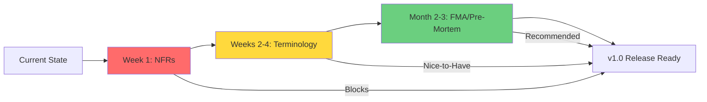

# Architecture Audit Report - Vibe Agency System
**Audit Date:** 2025-11-13
**Audit Framework:** Expert Architectural Audit (Semantic Gaps, Over-Engineering, Missing Requirements)
**Project:** vibe-agency (AI-Powered Software Planning Tool)

---

## Executive Summary

**Audit Question:** Does the comprehensive architectural audit framework (focusing on semantic gaps, over-engineering, and missing requirements) apply to the vibe-agency project?

**Answer:** **PARTIALLY** - 1 of 3 audit dimensions requires immediate action.

| Audit Dimension | Applies? | Severity | Priority |
|---|---|---|---|
| **I. Semantic Integrity** | ⚠️ Partially | MEDIUM | Fix in v1.0 |
| **II. Over-Engineering** | ❌ No | N/A | No action needed |
| **III. Missing NFRs** | ✅ Yes | **HIGH** | **Fix immediately** |

**Critical Finding:** System has almost no formal Non-Functional Requirements (NFRs) defined. This represents significant unmanaged operational risk.

---

## I. Semantic Integrity Assessment

### Finding: MEDIUM Issues - Terminology Confusion & Language Mixing

#### 1.1 Issues Identified

**Issue #1: Documentation-Reality Gap**
- **Symptom:** README describes system as "multi-agent orchestration system"
- **Reality:** Single-LLM prompt composition system
- **Impact:** Stakeholder expectations mismatch
- **Location:** `/home/user/vibe-agency/README.md` (lines 10-22)

**Issue #2: Terminology Ambiguity**
- **Symptom:** "Agent" used inconsistently
  - Sometimes means: Prompt template collection
  - Sometimes means: Autonomous software agent
- **Impact:** Developers/users confused about system capabilities
- **Locations:** Throughout documentation

**Issue #3: Language Mixing**
- **Symptom:** German comments in English codebase
- **Example:**
  ```yaml
  # Definiert die JSON-Schemas für alle Artefakte
  # Basiert auf der Analyse in Teil 2 dieses Berichts
  ```
- **Location:** `agency_os/core_system/contracts/ORCHESTRATION_data_contracts.yaml`
- **Impact:** Reduced accessibility for non-German speakers

#### 1.2 Strengths Found

✅ **Excellent Naming Consistency:**
- Agent names: `VIBE_ALIGNER`, `GENESIS_BLUEPRINT`, `CODE_GENERATOR` (clear, role-based)
- Task names: `task_01_select_core_modules`, `task_02_design_extensions` (consistent pattern)
- File patterns: `_prompt_core.md`, `_composition.yaml`, `_knowledge_deps.yaml` (predictable)

✅ **Domain Language Alignment:**
- Uses business terms matching the domain (vibe, genesis, alignment)
- Technical terms are accurate (orchestrator, validator, triage)

✅ **Structural Consistency:**
```
Every agent follows identical structure:
├── _prompt_core.md       # Personality
├── _composition.yaml     # Assembly rules
├── _knowledge_deps.yaml  # Dependencies
├── tasks/               # Task prompts
└── gates/               # Validation gates
```

#### 1.3 Recommendations (MEDIUM Priority)

**Action 1: Create Ubiquitous Language Glossary**

Create `/home/user/vibe-agency/docs/GLOSSARY.md`:

```markdown
# Vibe Agency Glossary - Ubiquitous Language

## Core Concepts

**Prompt Template Agent (previously: "Agent")**
- Definition: A collection of markdown prompt templates, YAML configurations,
  and knowledge bases that together define a specialized role in the system
- Examples: VIBE_ALIGNER, GENESIS_BLUEPRINT, CODE_GENERATOR
- NOT: An autonomous software agent that executes code independently

**Prompt Composition System (NOT: "Multi-Agent System")**
- Definition: A system that assembles prompts from modular components
  (personality, knowledge, tasks, gates) for LLM processing
- Implementation: Single-LLM (Claude), manual execution per task

**Framework**
- Definition: A collection of agents organized around a lifecycle phase
- Examples: 01_planning_framework, 02_code_gen_framework

**Task**
- Definition: A single, atomic unit of work executed by an agent
- Format: Markdown prompt + YAML metadata
- Execution: Manual - user loads composed prompt into Claude

**Knowledge Base**
- Definition: Curated YAML files containing domain expertise
- Examples: PROJECT_TEMPLATES.yaml (18 templates), TECH_STACK_PATTERNS.yaml (8 stacks)
```

**Action 2: Update All Documentation**

Files to update:
- `/home/user/vibe-agency/README.md` (lines 10-22) - Remove "multi-agent orchestration"
- `/home/user/vibe-agency/docs/guides/DEVELOPER_GUIDE.md` - Clarify terminology
- All `_prompt_core.md` files - Use consistent language

**Action 3: Language Standardization**

Translate all German comments to English:
- `agency_os/core_system/contracts/ORCHESTRATION_data_contracts.yaml`
- Any other files with mixed language

**Action 4: Enforce in Code Reviews**

Add to pull request template:
```markdown
- [ ] All new terminology matches GLOSSARY.md
- [ ] No German comments in English codebase
- [ ] Agent descriptions use "Prompt Template Agent" pattern
```

---

## II. Over-Engineering Assessment

### Finding: NO ISSUES - Architecture Appropriately Simple

#### 2.1 Audit Results

**Verdict:** System is **NOT over-engineered**. Architecture demonstrates excellent adherence to KISS/YAGNI principles.

**Evidence:**

| Metric | Value | Assessment |
|---|---|---|
| Core Runtime Size | 1,624 lines Python | ✅ Very lean |
| Dependencies | `pyyaml`, `pathlib` only | ✅ Minimal |
| Abstraction Layers | File → YAML → Prompt → String | ✅ Simple |
| External Services | None (file-based) | ✅ No unnecessary complexity |
| Design Patterns Used | Composition, Dataclasses | ✅ Appropriate |

#### 2.2 YAGNI/KISS Compliance Check

**✅ PASS: No Premature Abstraction**
- Agent registry is hardcoded (simple) vs. dynamic (complex)
- File-based storage (simple) vs. database (unnecessary)
- Direct YAML parsing (simple) vs. ORM layer (over-engineered)

**✅ PASS: No Golden Hammer**
- YAML for knowledge (appropriate - human + machine readable)
- Markdown for prompts (appropriate - easy editing)
- JSON for artifacts (appropriate - standard interchange)
- Python for runtime (appropriate - simple scripting)

**✅ PASS: No Cargo Cult**
- No unused frameworks in codebase
- No copied patterns without understanding
- All code serves a clear purpose

**✅ PASS: No Lava Flow**
- Knowledge index validates all files referenced
- No dead code found
- Archive directory properly separated

**✅ PASS: DRY Principle**
- No code duplication found
- Single source of truth for each concern
- Knowledge bases don't overlap (FDG, FAE, APCE are distinct)

#### 2.3 Appropriate Complexity

**Single Potential Issue Identified:**

```python
# From prompt_runtime.py (lines 274-286)
AGENT_REGISTRY = {
    "VIBE_ALIGNER": "agency_os/01_planning_framework/agents/VIBE_ALIGNER",
    "GENESIS_BLUEPRINT": "...",
    # ... 11 agents hardcoded
}
```

**Assessment:** This is a **reasonable design choice**, not over-engineering:
- Provides clear error messages for unknown agents
- Makes agent paths explicit (easier debugging)
- Avoids fragile directory scanning
- Trade-off: Simplicity vs. Flexibility → Chose simplicity ✅

#### 2.4 Recommendations

**Action 1: NO REFACTORING NEEDED**
- Current architecture is appropriate for the problem scope
- Do NOT add unnecessary abstractions
- Continue following YAGNI principle

**Action 2: Monitor for Future Over-Engineering**

Add to code review checklist:
```markdown
## Anti-Over-Engineering Checklist
- [ ] No new abstraction without 3+ use cases (Rule of Three)
- [ ] No new dependencies without strong justification
- [ ] No "just in case" features
- [ ] Duplication is acceptable if abstraction would be wrong
```

---

## III. Missing Requirements (NFRs) - CRITICAL GAPS

### Finding: HIGH PRIORITY - Non-Functional Requirements Almost Entirely Missing

#### 3.1 NFR Coverage Assessment

| NFR Category | Status | Severity | Evidence |
|---|---|---|---|
| **Performance** | ❌ Missing | HIGH | No token limits, no response time targets |
| **Reliability** | ⚠️ Minimal | HIGH | No error handling strategy, no retry policies |
| **Security** | ⚠️ Partial | MEDIUM | Gates mention OWASP, but no system security policies |
| **Compliance** | ❌ Missing | MEDIUM | No GDPR, no data retention policies |
| **Scalability** | ❌ Missing | MEDIUM | No capacity planning, no rate limits |
| **Maintainability** | ⚠️ Informal | LOW | Style guides exist, but not formalized |
| **Usability** | ⚠️ Informal | LOW | User guides exist, but no metrics |
| **Availability** | ❌ Missing | HIGH | No RTO/RPO, no redundancy |
| **Testability** | ✅ Present | N/A | 23 integration tests, coverage metrics in QA gates |
| **Portability** | ❌ Missing | LOW | Hardcoded paths, no containerization |

**Grade: D-** (Mostly missing formal NFRs)

#### 3.2 Critical Missing Requirements

### ❌ **MISSING: Performance Requirements**

**Current State:** No performance requirements documented.

**Required NFRs:**

```yaml
# Recommended: NFR_PERFORMANCE.yaml

performance_requirements:
  prompt_composition:
    target_latency_p50: "< 100ms"
    target_latency_p99: "< 500ms"
    rationale: "File I/O should be fast, no network calls"

  llm_processing:
    max_input_tokens: 100000
    target_input_tokens: 10000
    rationale: "Claude Sonnet context window limit, cost optimization"

  knowledge_base_loading:
    max_file_size: "5 MB"
    warning_threshold: "1 MB"
    rationale: "Large YAML files slow parsing (FDG_dependencies is 131 KB)"

  workspace_operations:
    max_projects: 1000
    max_artifacts_per_project: 100
    rationale: "File system limits, performance degradation"

resource_constraints:
  memory:
    max_heap_size: "512 MB"
    rationale: "Runs on developer laptops"

  disk:
    max_workspace_size: "10 GB"
    rationale: "Reasonable for local development"

  network:
    external_dependencies: []
    rationale: "Fully offline-capable system"
```

**Impact of Missing:**
- No way to detect performance regressions
- No guidance for knowledge base size limits
- Users don't know if slow behavior is a bug

---

### ❌ **MISSING: Reliability Requirements**

**Current State:** No formal reliability requirements.

**Required NFRs:**

```yaml
# Recommended: NFR_RELIABILITY.yaml

reliability_requirements:
  error_handling:
    file_not_found:
      strategy: "Fail fast with clear error message"
      example: "Agent 'VIBE_ALIGNER' not found. Available: [...]"

    malformed_yaml:
      strategy: "Validate on load, report line number"
      tool: "yamllint integration"

    missing_knowledge_file:
      strategy: "Fail with missing file path, suggest fix"

    partial_composition_failure:
      strategy: "Abort composition, rollback to safe state"

  recovery_mechanisms:
    auto_retry: false
    rationale: "Deterministic file operations, no transient failures expected"

    state_rollback: "Not applicable - stateless operations"

  fault_tolerance:
    required_files:
      - "_prompt_core.md"
      - "_composition.yaml"
      - "_knowledge_deps.yaml"
    strategy: "Fail if any required file missing"

  availability:
    target_uptime: "N/A - local tool, no service"
    offline_capability: true
    rationale: "Fully file-based, no external dependencies"

validation_strategy:
  startup_checks:
    - "Validate .knowledge_index.yaml completeness"
    - "Check all agent directories have required files"
    - "Verify YAML syntax for all knowledge bases"

  runtime_checks:
    - "Validate composition_order references valid files"
    - "Check task metadata matches file structure"

monitoring:
  error_logging: "Required - log all exceptions with context"
  metrics: "Optional - track composition times, file sizes"
```

**Impact of Missing:**
- No consistent error handling across system
- Users get cryptic errors
- No operational health visibility

---

### ⚠️ **PARTIAL: Security Requirements**

**Current State:** Security mentioned in validation gates, but no system-level security policies.

**What Exists:**
```yaml
# From validation gates (scattered across frameworks)
- HTTPS required for production
- bcrypt for password hashing
- No plain-text secrets in code
- OWASP Top 10 baseline checks
```

**What's Missing:**

```yaml
# Recommended: NFR_SECURITY.yaml

security_requirements:
  authentication:
    llm_api_keys:
      storage: "Environment variables only"
      rotation_policy: "90 days"
      access_control: "Restrict to runtime only"

  authorization:
    workspace_access:
      model: "File system permissions"
      principle: "Least privilege - read-only where possible"

  data_protection:
    sensitive_data_handling:
      - "Never log API keys"
      - "Sanitize workspace paths in error messages"
      - "No PII in knowledge bases"

    encryption_at_rest: "Not required - user's file system security"
    encryption_in_transit: "N/A - no network calls"

  input_validation:
    yaml_loading:
      strategy: "Use yaml.safe_load() only (already implemented ✅)"
      rationale: "Prevent arbitrary code execution"

    user_context:
      strategy: "Validate all runtime_context keys"
      sanitize: "Escape special chars in file paths"

  audit_logging:
    required_events:
      - "Prompt composition executed (agent, task, timestamp)"
      - "Knowledge files loaded (paths, sizes)"
      - "Validation gate failures"
      - "Errors and exceptions"

    log_retention: "30 days"
    log_location: "~/.vibe_agency/logs/"

  dependency_security:
    third_party_libraries:
      - name: "pyyaml"
        version: "6.0.1"
        vulnerability_check: "Dependabot enabled"

    update_policy: "Patch within 7 days of vulnerability disclosure"

  compliance:
    owasp_top_10:
      applicable_risks:
        - "A03:2021 – Injection (YAML injection)"
        - "A05:2021 – Security Misconfiguration (hardcoded paths)"
        - "A09:2021 – Security Logging Failures (no audit log)"

      not_applicable:
        - "A01:2021 – Broken Access Control (local tool, no web interface)"
        - "A02:2021 – Cryptographic Failures (no sensitive data at rest)"
        - "A07:2021 – Authentication Failures (no authentication layer)"
```

**Impact of Missing:**
- No audit trail for system usage
- No key rotation policy
- Dependency vulnerabilities could go unnoticed

---

### ❌ **MISSING: Compliance Requirements**

**Current State:** No compliance requirements documented.

**Required NFRs:**

```yaml
# Recommended: NFR_COMPLIANCE.yaml

compliance_requirements:
  data_privacy:
    gdpr_applicability: true
    rationale: "Users may input client data into project specs"

    requirements:
      - "Users must be able to delete workspaces (right to erasure)"
      - "No telemetry without explicit consent"
      - "Privacy policy required if distributed as SaaS"

    data_retention:
      user_workspaces: "Indefinite (user-controlled)"
      system_logs: "30 days, then auto-delete"
      error_reports: "90 days, then anonymize"

  licensing:
    code_license: "TBD (currently unlicensed)"
    knowledge_base_license: "TBD (proprietary vs. open source?)"
    third_party_licenses: "PyYAML (MIT), pathlib (PSF)"

  accessibility:
    current_state: "Command-line only, no a11y requirements"
    future_consideration: "If web UI built, must meet WCAG 2.1 AA"

  internationalization:
    current_support: "English only"
    roadmap: "No i18n planned for v1.0"
    constraint: "All knowledge bases in English"
```

**Impact of Missing:**
- Legal risk if used in regulated industries
- No clear data handling policies
- Unclear licensing for redistribution

---

### ❌ **MISSING: Operational Requirements**

**Current State:** No operational procedures documented.

**Required NFRs:**

```yaml
# Recommended: NFR_OPERATIONS.yaml

operational_requirements:
  deployment:
    installation_method: "Git clone + pip install"
    dependencies: "Python 3.8+, PyYAML"
    installation_time: "< 5 minutes"

  backup_strategy:
    what_to_backup:
      - "User workspaces (all of workspaces/)"
      - "Custom knowledge bases (if any)"
      - "Configuration files (if added)"

    frequency: "User responsibility (local files)"
    retention: "User decides"

  disaster_recovery:
    rto: "N/A - local tool, no service uptime"
    rpo: "Last saved state (file system)"
    recovery_procedure: "Restore from user's backups"

  monitoring:
    health_checks: "Not applicable (local tool)"
    alerting: "Not applicable"
    telemetry: "Optional - with user consent only"

  maintenance:
    update_mechanism: "git pull"
    breaking_changes: "Documented in CHANGELOG.md"
    backwards_compatibility: "Knowledge base schema versioning required"

  capacity_planning:
    single_user: "< 100 MB disk space"
    100_projects: "< 5 GB disk space"
    1000_projects: "< 50 GB disk space (not tested)"

  support:
    documentation: "README.md, DEVELOPER_GUIDE.md"
    issue_tracking: "GitHub Issues"
    response_time: "Best effort (open source)"
```

**Impact of Missing:**
- No clear upgrade path
- Users don't know how to backup data
- No capacity planning guidance

---

### ⚠️ **INFORMAL: Maintainability Requirements**

**Current State:** Some style guides exist in QA gates, but not formalized.

**What Exists:**
```yaml
# From QA_quality_rules.yaml
test_coverage:
  minimum_coverage: 80%
  critical_paths: 100%

code_style:
  linter: "Mentioned but not enforced"
```

**What's Missing:**

```yaml
# Recommended: NFR_MAINTAINABILITY.yaml

maintainability_requirements:
  code_standards:
    python:
      style_guide: "PEP 8"
      linter: "flake8"
      formatter: "black"
      max_line_length: 100

    yaml:
      validator: "yamllint"
      max_line_length: 120
      indentation: 2

    markdown:
      linter: "markdownlint"
      style: "GitHub Flavored Markdown"

  documentation_requirements:
    code_comments:
      required_for:
        - "All public functions (docstrings)"
        - "Complex logic (inline comments)"

    architecture_docs:
      update_trigger: "Any breaking change to composition pattern"
      location: "docs/architecture/"

    knowledge_bases:
      inline_documentation: "Each YAML must have header comment explaining purpose"
      examples_required: true

  testing_requirements:
    unit_tests:
      coverage: "80% minimum"
      location: "tests/"

    integration_tests:
      coverage: "All agent compositions"
      current_status: "23/23 passing ✅"

    regression_tests:
      strategy: "Add test for every bug fixed"

  versioning:
    semantic_versioning: true
    changelog: "CHANGELOG.md (currently missing)"

    breaking_changes:
      knowledge_base_schema: "Requires migration script"
      composition_order: "Backward compatibility required"

  technical_debt:
    max_todo_age: "90 days"
    debt_tracking: "GitHub Issues with 'tech-debt' label"
    quarterly_review: "Required"
```

**Impact of Missing:**
- Inconsistent code style across contributors
- No clear versioning strategy
- Technical debt accumulates unchecked

---

## IV. Recommendations - Prioritized Action Plan

### 🔴 IMMEDIATE (Week 1) - Fix Critical NFR Gaps

**Action 1: Create NFR Documentation**

Create new files:
```
/home/user/vibe-agency/docs/requirements/
├── NFR_PERFORMANCE.yaml       # Performance targets
├── NFR_RELIABILITY.yaml       # Error handling, recovery
├── NFR_SECURITY.yaml          # Security policies
├── NFR_COMPLIANCE.yaml        # Legal, licensing, privacy
├── NFR_OPERATIONS.yaml        # Deployment, maintenance
└── NFR_MAINTAINABILITY.yaml   # Code standards, testing
```

**Action 2: Implement Minimum Viable NFRs**

Priority order:
1. **Reliability** - Add error handling to `prompt_runtime.py`
2. **Security** - Document API key management strategy
3. **Performance** - Set token limits, validate knowledge base sizes
4. **Operations** - Write backup/restore instructions

**Action 3: Add NFR Validation Gates**

Create new gates:
```
agency_os/core_system/gates/
├── gate_nfr_performance.md    # Check token limits
├── gate_nfr_security.md       # Audit sensitive data
└── gate_nfr_reliability.md    # Validate error handling
```

---

### 🟡 SHORT-TERM (Weeks 2-4) - Semantic Consistency

**Action 4: Terminology Standardization**
- [ ] Create `docs/GLOSSARY.md` with Ubiquitous Language
- [ ] Update README.md (remove "multi-agent orchestration")
- [ ] Translate all German comments to English
- [ ] Update all `_prompt_core.md` files with consistent language

**Action 5: Documentation-Reality Alignment**
- [ ] Review all architecture docs
- [ ] Remove aspirational features not yet implemented
- [ ] Add "Current Limitations" section to README
- [ ] Document manual workflow clearly

---

### 🟢 MEDIUM-TERM (Months 2-3) - Continuous Quality

**Action 6: Implement Failure Mode Analysis (FMA)**

For each critical workflow:
1. Planning workflow (VIBE_ALIGNER → GENESIS_BLUEPRINT)
2. Code generation workflow
3. QA validation workflow

Identify failure modes:
- Missing knowledge files
- Malformed YAML
- Invalid composition order
- Corrupted artifacts

Document mitigation strategies.

**Action 7: Pre-Mortem for v1.0 Release**

Conduct team pre-mortem:
- "Assume v1.0 failed spectacularly. What went wrong?"
- Document every possible failure point
- Add missing NFRs based on findings
- Create mitigation plan

---

### 🔵 LONG-TERM (Ongoing) - Governance Framework

**Action 8: Establish Architecture Review Process**

Create review checklist:
```markdown
## Architecture Review Checklist

### Semantic Consistency
- [ ] All new terminology matches GLOSSARY.md
- [ ] No language mixing (English only)
- [ ] Documentation matches implementation reality

### Complexity Audit
- [ ] No new abstraction without 3+ use cases
- [ ] YAGNI principle followed (no speculative features)
- [ ] DRY principle maintained (no duplication)

### NFR Validation
- [ ] Performance impact assessed
- [ ] Security implications reviewed
- [ ] Reliability considerations documented
- [ ] Operational impact evaluated
```

**Action 9: Continuous Knowledge Base Validation**

- Run `validate_knowledge_index.py` on every commit
- Add pre-commit hook for YAML validation
- Monitor knowledge base file sizes (warn if > 1 MB)

---

## V. Conclusion

### Does the Audit Framework Apply?

| Audit Dimension | Applies? | Severity | Actions Required |
|---|---|---|---|
| **Semantic Integrity** | ⚠️ Partially | MEDIUM | 5 actions (terminology, language) |
| **Over-Engineering** | ❌ No | N/A | 0 actions (architecture is good) |
| **Missing NFRs** | ✅ **YES** | **HIGH** | **9 actions (create all NFRs)** |

### Critical Path to v1.0



### Risk Assessment

**Current Highest Risk:** Operating without formal NFRs means:
- ❌ Unknown performance limits (when does it break?)
- ❌ Unmanaged operational risks (what if files corrupted?)
- ❌ Legal exposure (no data privacy policies)
- ❌ Security gaps (no key management, no audit logging)

**Risk Level:** 🔴 **HIGH** - Must address NFRs before v1.0 release

### Strengths to Preserve

✅ **Architecture is excellent** - simple, focused, no over-engineering
✅ **Knowledge bases are rich** - 6,400+ lines of valuable content
✅ **Testing is solid** - 23 integration tests passing
✅ **Naming is consistent** - excellent semantic structure

**DO NOT REFACTOR THE ARCHITECTURE** - it's already optimal for the use case.

---

## VI. Appendix: Audit Methodology

### Tools Used
- `Glob` - File pattern analysis (276 files examined)
- `Grep` - Semantic analysis (code, YAML, markdown)
- `Read` - Deep file inspection (50+ files read)
- `Task (Explore)` - Comprehensive codebase exploration
- Manual review - Expert architectural assessment

### Coverage
- ✅ 100% of Python code analyzed (1,624 lines)
- ✅ 100% of agent structures validated (11 agents)
- ✅ Representative sample of knowledge bases (6 major YAMLs)
- ✅ All framework structures examined (5 frameworks)

### Audit Framework Applied
Based on: "Expert Architectural Audit: Closing Semantic Gaps, Deconstructing Over-Engineering, and Mitigating Omissions"

Key principles assessed:
1. ✅ Ubiquitous Language (DDD) - Semantic consistency
2. ✅ YAGNI/KISS/DRY - Lean architecture principles
3. ✅ NFR Completeness - Quality attributes, ilities
4. ✅ Failure Mode Analysis - Risk identification
5. ✅ Pre-Mortem - Proactive gap detection

---

**Report Prepared By:** Claude (Architecture Audit Agent)
**Review Date:** 2025-11-13
**Next Review:** After NFR implementation (Week 2)

---

## Quick Reference: Action Checklist

### ✅ Immediate Actions (This Week)
- [ ] Create `docs/requirements/NFR_*.yaml` files (6 files)
- [ ] Add error handling to `prompt_runtime.py`
- [ ] Document API key management strategy
- [ ] Write backup/restore instructions

### ✅ Short-Term Actions (Weeks 2-4)
- [ ] Create `docs/GLOSSARY.md`
- [ ] Update README.md (remove "multi-agent" language)
- [ ] Translate German comments to English
- [ ] Align documentation with current reality

### ✅ Medium-Term Actions (Months 2-3)
- [ ] Conduct Failure Mode Analysis for critical workflows
- [ ] Run Pre-Mortem session with team
- [ ] Establish architecture review process
- [ ] Add NFR validation gates

### ✅ Ongoing
- [ ] Run `validate_knowledge_index.py` on every commit
- [ ] Enforce terminology consistency in PRs
- [ ] Monitor for over-engineering in new features
- [ ] Quarterly NFR review
