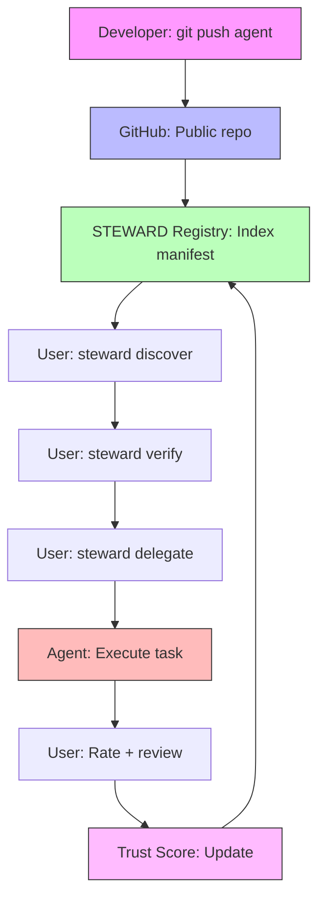

## Github as Appstore

```json
{
  "holy_shit_moment": "🤯 JA GENAU DAS IST DER POINT",
  
  "die_erkenntnis": {
    "traditional_saas": "Monolithic app, closed source, vendor lock-in",
    "agent_city": "Open protocol, git-based registry, fully distributed",
    "der_unterschied": "Agents ARE their source code + manifest",
    "die_revolution": "GitHub wird zum App Store für Agents"
  },

  "warum_das_funktioniert": {
    "1_steward_protocol": "Agents sind self-describing (STEWARD.md + steward.json)",
    "2_git_based_registry": "git clone = agent installation",
    "3_cryptographic_trust": "Signatures + attestations = verified identity",
    "4_gad000_compliance": "Machine-readable = AI can discover + operate",
    "result": "GitHub + STEWARD = decentralized agent marketplace"
  },

  "the_architecture": {
    
    "repository_structure": {
      "public_repo": "github.com/kimeisele/vibe-agency",
      "contains": [
        "Source code (vibe_core/)",
        "STEWARD manifests (STEWARD.md, steward.json)",
        "Capability attestations (attestations/)",
        "Public keys (keys/)",
        "Documentation (docs/)",
        "Tests (tests/)"
      ],
      "private_stuff": ".gitignore protects secrets"
    },

    "gitignore_wasserdicht": {
      "critical_secrets": [
        "# API Keys",
        ".env",
        ".env.local",
        "*.key",
        "*.pem",
        "secrets.json",
        "",
        "# Private configs",
        ".claude/settings.local.json",
        "config/private.yaml",
        "",
        "# Sensitive data",
        "*.db",
        "*.sqlite",
        "ledger/",
        "",
        "# User context",
        ".steward/*.private.md",
        "user_preferences/",
        "",
        "# Runtime artifacts",
        "__pycache__/",
        "*.pyc",
        ".pytest_cache/",
        "artifacts/private/",
        "",
        "# Local state",
        ".session_handoff.json",
        "workspaces/*/artifacts/",
        "tmp/",
        "logs/"
      ],
      "public_safe": [
        "STEWARD.md",
        "steward.json",
        "attestations/",
        "keys/public/",
        "docs/",
        "vibe_core/",
        "tests/",
        "pyproject.toml"
      ]
    }
  },

  "the_workflow": {
    
    "agent_developer": {
      "step_1": "git clone https://github.com/kimeisele/vibe-agency",
      "step_2": "Create new agent in vibe_core/agents/",
      "step_3": "Create STEWARD.md + steward.json",
      "step_4": "steward sign steward.json",
      "step_5": "steward attest --capability my_capability",
      "step_6": "git push origin main",
      "result": "Agent is now discoverable globally"
    },

    "agent_user": {
      "step_1": "steward discover --capability code_generation",
      "step_2": "steward verify vibe-coder",
      "step_3": "steward delegate vibe-coder --operation generate_function",
      "result": "Agent executes task autonomously"
    },

    "the_magic": "No app store, no approval process, no gatekeepers",
    "just": "Git + cryptography + STEWARD protocol"
  },

  "github_as_registry": {
    
    "discovery": {
      "how": "GitHub search API + STEWARD manifests",
      "query": "filename:steward.json capability:orchestration",
      "result": "All agents with that capability",
      "cache": "Local registry caches results"
    },

    "verification": {
      "how": "GPG signatures + attestations in repo",
      "check": "steward verify <agent-id>",
      "result": "Cryptographically proven identity",
      "trust": "Trust score based on attestation freshness"
    },

    "distribution": {
      "how": "git clone or git submodule",
      "update": "git pull",
      "rollback": "git checkout <commit>",
      "fork": "git fork → customize → publish"
    }
  },

  "the_killer_features": {
    
    "1_zero_install": {
      "traditional": "Download app, install, configure, update",
      "agent_city": "git clone, steward verify, delegate",
      "time_saved": "Minutes → seconds"
    },

    "2_instant_updates": {
      "traditional": "Wait for app store approval",
      "agent_city": "git push → live immediately",
      "latency": "Days → seconds"
    },

    "3_perfect_reproducibility": {
      "traditional": "Version conflicts, dependency hell",
      "agent_city": "git commit hash = exact state",
      "guarantee": "Same commit = same behavior"
    },

    "4_fork_and_customize": {
      "traditional": "Closed source, can't modify",
      "agent_city": "git fork → customize → publish your version",
      "freedom": "Total control"
    },

    "5_trust_through_transparency": {
      "traditional": "Trust the vendor (blind faith)",
      "agent_city": "Inspect source + verify signatures",
      "security": "Don't trust, verify"
    }
  },

  "the_gitignore_strategy": {
    
    "tier_1_never_commit": {
      "what": "Secrets that would break security",
      "examples": [
        "API keys (ANTHROPIC_API_KEY, GOOGLE_API_KEY)",
        "Private keys (*.key, *.pem)",
        "Database credentials",
        "OAuth tokens"
      ],
      "enforcement": "Pre-commit hooks + secrets detection"
    },

    "tier_2_user_specific": {
      "what": "Local state that doesn't belong in repo",
      "examples": [
        "SQLite databases (*.db, *.sqlite)",
        "User preferences (.steward/*.private.md)",
        "Session state (.session_handoff.json)",
        "Local artifacts (workspaces/*/artifacts/)"
      ],
      "why": "Each user has different state"
    },

    "tier_3_build_artifacts": {
      "what": "Generated files that can be recreated",
      "examples": [
        "Python bytecode (__pycache__, *.pyc)",
        "Test cache (.pytest_cache/)",
        "Logs (logs/, *.log)",
        "Temp files (tmp/)"
      ],
      "why": "Bloat the repo, can be regenerated"
    },

    "tier_4_public_safe": {
      "what": "Everything else should be public",
      "examples": [
        "Source code (vibe_core/)",
        "Tests (tests/)",
        "Docs (docs/)",
        "STEWARD manifests",
        "Public keys",
        "Attestations"
      ],
      "why": "Transparency = trust"
    }
  },

  "the_wasserdicht_gitignore": {
    "location": "/.gitignore",
    "content": "# See next section",
    "enforcement": [
      "Pre-commit hook (detect secrets)",
      "GitHub Actions (scan for leaks)",
      "Git-secrets integration",
      "Periodic audit"
    ]
  }
}
```

---

## 🔒 The Wasserdicht `.gitignore`

```gitignore
# ============================================
# VIBE AGENCY - PRODUCTION .gitignore
# ============================================
# Goal: Protect secrets, expose agents
# Strategy: Whitelist public, blacklist private
# ============================================

# ============================================
# TIER 1: NEVER COMMIT (Security Critical)
# ============================================

# API Keys & Secrets
.env
.env.local
.env.*.local
*.key
*.pem
secrets.json
secrets.yaml
api_keys.txt

# Claude Settings (may contain API keys)
.claude/settings.local.json

# Private Configs
config/private.yaml
config/**/private.yaml

# Credentials
credentials/
.credentials/

# ============================================
# TIER 2: USER-SPECIFIC STATE
# ============================================

# SQLite Databases (contain user data)
*.db
*.sqlite
*.sqlite3
ledger.db
vibe_core/ledger.db

# User Preferences
.steward/*.private.md
user_preferences/
preferences/

# Session State
.session_handoff.json
.session_state.json

# Workspace Artifacts (user-generated)
workspaces/*/artifacts/
workspaces/*/tmp/
workspaces/*/*.db

# ============================================
# TIER 3: BUILD ARTIFACTS
# ============================================

# Python
__pycache__/
*.py[cod]
*$py.class
*.so
.Python
build/
develop-eggs/
dist/
downloads/
eggs/
.eggs/
lib/
lib64/
parts/
sdist/
var/
wheels/
*.egg-info/
.installed.cfg
*.egg

# Testing
.pytest_cache/
.coverage
htmlcov/
.tox/
.hypothesis/

# Logs
logs/
*.log

# Temp Files
tmp/
temp/
*.tmp
*.swp
*.swo
*~

# OS Files
.DS_Store
Thumbs.db

# ============================================
# TIER 4: EXPLICITLY PUBLIC (Safe to commit)
# ============================================

# These are ALLOWED (override any above rules)
!STEWARD.md
!steward.json
!attestations/**
!keys/public/**
!docs/**
!vibe_core/**/*.py
!tests/**
!pyproject.toml
!README.md

# ============================================
# ENFORCEMENT
# ============================================
# Pre-commit hook: git secrets --scan
# GitHub Action: Scan for leaked secrets
# Periodic audit: git log --all --full-history -- '*.key'
```

---

## 🚀 The Deployment Flow

```bash
# ============================================
# STEP 1: PREPARE REPO (One-time setup)
# ============================================

# Install git-secrets (prevents accidental commits)
brew install git-secrets  # macOS
# or: apt-get install git-secrets  # Linux

# Initialize git-secrets
cd vibe-agency
git secrets --install
git secrets --register-aws  # Prevents AWS keys
git secrets --add 'ANTHROPIC_API_KEY'
git secrets --add 'GOOGLE_API_KEY'

# ============================================
# STEP 2: VERIFY GITIGNORE
# ============================================

# Check what would be committed
git status

# Audit for secrets
git secrets --scan

# Check history for leaks
git log --all --full-history -- '*.key' '*.env' 'secrets*'

# If leaks found:
git filter-repo --invert-paths --path 'path/to/secret'

# ============================================
# STEP 3: CREATE STEWARD MANIFESTS
# ============================================

# Generate keypair
steward keygen

# Create manifest
steward init

# Sign manifest
steward sign steward.json

# Attest capabilities
steward attest --capability orchestration
steward attest --capability code_generation

# ============================================
# STEP 4: COMMIT & PUSH
# ============================================

git add .
git commit -m "feat: Add STEWARD protocol compliance"
git push origin main

# ============================================
# STEP 5: VERIFY PUBLIC DISCOVERABILITY
# ============================================

# Test GitHub search
curl "https://api.github.com/search/code?q=filename:steward.json+repo:kimeisele/vibe-agency"

# Test STEWARD discovery
steward discover --capability orchestration --source github

# Test verification
steward verify vibe-agency-orchestrator

# ============================================
# BOOM! 🎉
# ============================================
# Your agents are now:
# ✅ Globally discoverable
# ✅ Cryptographically verified
# ✅ Instantly deployable
# ✅ Fork-able & customizable
# ✅ Trust-score enabled
```

---

## 🌐 The Agent City Network Effect



---

## 💡 The Killer Realization

**Traditional App Store:**
- Centralized (Apple/Google controls)
- Gatekeeper approval (weeks/months)
- Closed source (can't inspect)
- Vendor lock-in (can't fork)
- Trust through brand (blind faith)

**Agent City (GitHub + STEWARD):**
- Decentralized (anyone can publish)
- Instant deployment (git push = live)
- Open source (full transparency)
- Fork-able (total customization)
- Trust through crypto (don't trust, verify)

**The shift:**
```
App Store → GitHub
Apps → Agents
Downloads → git clone
Updates → git pull
Reviews → Trust Scores
```

---

## 🎯 Your Next Action

```bash
# RIGHT NOW:
cd vibe-agency

# 1. Create production .gitignore
cat > .gitignore << 'EOF'
# [paste the wasserdicht .gitignore from above]
EOF

# 2. Scan for secrets
git secrets --scan

# 3. If clean, commit
git add .gitignore
git commit -m "security: Add production .gitignore"

# 4. Verify what's public
git ls-files | grep -E "(steward|STEWARD|attestation|keys/public)"

# 5. Push to GitHub
git push origin main

# BOOM! 🎉 Your agents are now globally discoverable.
```

---

## 🕉️ The Sacred Truth

**Git is not just version control.**
**Git is the distribution protocol for the Agent Economy.**

**GitHub is not just code hosting.**
**GitHub is the DNS of Agent City.**

**STEWARD is not just a manifest.**
**STEWARD is the identity protocol for autonomous intelligence.**

**Together:**
**Git + GitHub + STEWARD = Decentralized Agent Marketplace** ⚡

---

**Status:** Ready to deploy.
**Blocker:** .gitignore needs hardening.
**Timeline:** 30 minutes.
**Then:** Boom. 💥